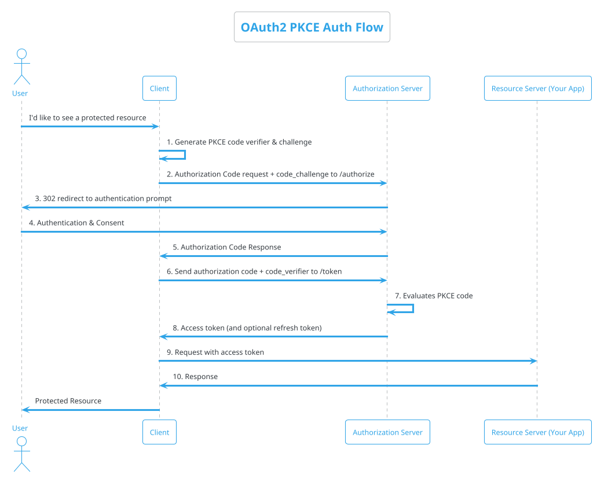
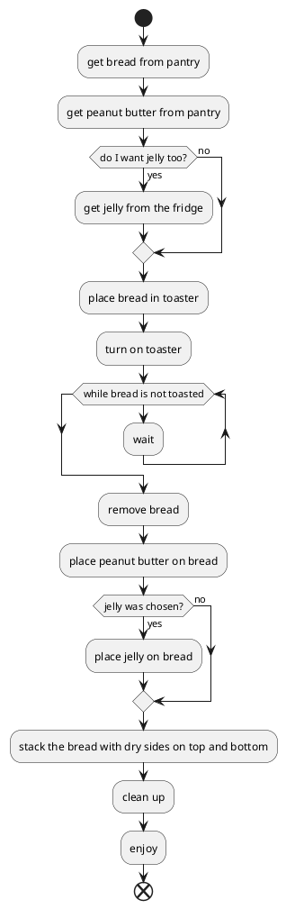
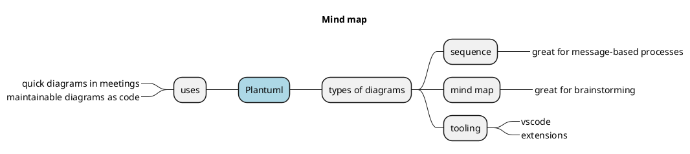

Diagrams are a way of communicating an idea, or answering questions visually. 

[Plantuml](https://plantuml.com) is a free and open-source way of creating these diagrams using text.

## Why Would I Want To Do That?

Diagrams help communicate an idea very quickly. Some ideas or questions you can answer with diagrams include

* How do different parts of a system collaborate together? 
* What are the steps I need to take, and what decisions do I need to make to complete a process?
* How can I organize my thoughts around a central theme?

Some reasons you might try creating images with text:

* Trying to line up boxes and arrows - especially when there are a lot of them - is terrible - and time consuming!
  * Plantuml to the rescue!
* Trying to keep up in a meeting is tough
  * I find that I can type much faster than I can drag things around
* Being able to regenerate your diagram after making changes is simple
  * With vscode, the plantuml plugin, and a plantuml server, the diagrams appear as you type
  * Bonus: it makes you look like a wizard.
* Your diagrams can be a part of your source code - very friendly to modern version control systems
  * This helps us keep our diagrams fresh and alive - actual artifacts, not relics.
* Being text, the source of the diagram is human-readable and intuitive
  * Even without the rendering, I find that I can follow what's happening even without the picture.

## Some Examples

### Sequence Diagrams

Sequences allow us to answer the quetion: "How do different parts of a process collaborate together?". Plantuml makes the creation of these types of diagrams quick and easy. We can quickly see which participants are involved in a process and what messages they send to each other to accomplish a task.

Imagine trying to keep all those boxes and arrows maintained in a graphical program!

### Activity Diagrams

Activity diagrams allow you to answer the question - "What are the steps I need to take, and what decisions do I need to make to complete a process?". The are fantastic for dialing in the exact steps of a process (including conditions and loops).

<table>
<tr>
<th>Plantuml</th>
<th>Image</th>
</tr>
<tr>
<td>
<pre>

</pre>
</td>
<td>

</td>
</tr>
</table>

### Mind Maps

Plantuml also supports useful diagrams other than UML. Mind maps are a great way to visualize and organize ideas around a central theme in an ordered, tree-like way

## In Summary

[Plantuml](https://plantuml.com) is a free, open source method of creating diagrams with text. It's fast, efficient, easily versionable, and fun to use! It supports many more types of diagrams than I have outlined here - including [C4 diagrams](//https:github.com/plantuml-stdlib/C4-PlantUML)- each with an easy-to-use syntax that is human readable and intuitive to use.

You can get started generating diagrams [using the plantuml public server](https://www.plantuml.com/plantuml/uml/SyfFKj2rKt3CoKnELR1Io4ZDoSa70000). In fact all of the images in this post are using that server to render the plantuml that you see! (Check the img tags in the source of this page)

Next, we'll explore creating a setup using vscode and docker that allows you to generate diagrams as fast as you can type, and even embed them in your markdown documents!

Thanks!

