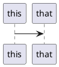

The best way to create diagrams with PlantUML is with:

* VSCode
* PlantUML vscode extension
* PlantUML server (in docker)

If you don't have or don't want to install Docker on your machine (I would ask "why not?") you can make sure you have Java _and_ Graphviz installed to render PlantUML with a jar file. I'll go through that setup separately.


## VSCode

If you're reading this, you probably already have VSCode, but just for completeness: You can [get it here](https://code.visualstudio.com/)

## PlantUML Plugin

Open up VSCode extension panel and install the PlantUML extension:


Open up the settings by clicking on the gear once it's installed.


Add rending PlantUML inside Markdown files by adding the `md` file extension to the list


Add rendering support 


You should be able to render PlantUML diagrams in markdown files by adding

<pre>

</pre>

into your markdown file. Your PlantUML diagram syntax goes between the `@startuml` and `@enduml`

At this point - if you are rendering a diagram that you don't mind sharing with the Internet, then you're done! However, if you _don't_ want to share your diagrams with the Internet, then you want to do the next part: Install PlantUML Server locally and use _that_ for rendering.

## Local PlantUML Server In Docker

Once you have Docker installed, it's very simple to start the plantuml server locally:

```sh
$ docker run -d -p 8080:8080 plantuml/plantuml-server:jetty
```

You can now change the plantuml extension PlantUML Server setting to `http://localhost:8080` And... you're done!

## PlantUML Jar (Alternative Install)

If you don't have and don't want docker, but _do_ have Java _and_ Graphviz installed on your machine, You can download PlantUML as a `.jar` file. The extension settings change to:


You'll have to fill in the path to the jar, the path to Java, and set the rendering to Local.

I do not recommend this method. The server render is _much_ faster. Using this method, Java has to spin up and load the jar file every time, so the user experience is much slower and less ideal.

## Putting it all together: A Demo

When everything is working together as intended, you should be able to do something like this:


Many thanks to the developers of [PlantUML](https://plantuml.com), [VSCode](https://code.visualstudio.com), and the [PlauntUML extension](https://marketplace.visualstudio.com/items?itemName=jebbs.plantuml). You have made my life much easier!
